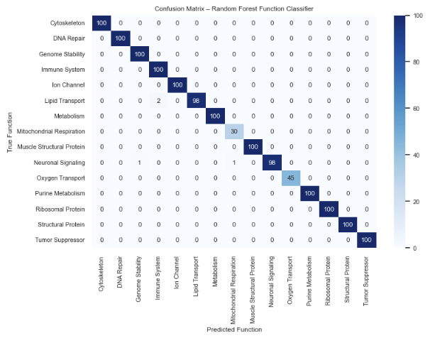

# Gene Function & Mutation Impact Prediction Model

This project addresses the challenge of transforming raw genomic sequence data into structured, machine-learning–ready representations capable of supporting gene function classification and mutation impact analysis.

Table of contents
- Overview
- Key achievements
- Quickstart
- Notebooks
- Visualizations & references
- Reproducibility
- Project structure
- Outcomes
- Contributing & contact
- License

# Overview
This repository demonstrates an end-to-end data science workflow on biological sequence data:
1. Data acquisition from NCBI GenBank (Entrez E-utilities).
2. Structured, biologically-relevant feature engineering (nucleotide composition, amino-acid composition, CDS metrics, k-mer frequencies, etc.).
3. Model development and selection (Logistic Regression, GaussianNB, Random Forest — Random Forest selected).
4. Mutation-impact prediction framework using synthetic mutations and model inference.
5. Visualizations and interpretability analyses (PCA, pairwise relationships, confusion matrices, feature importance).

# Key achievements
- Implemented a reproducible pipeline that converts raw GenBank records into a feature matrix ready for ML.
- Engineered domain-specific features (k-mers, CDS metrics, amino-acid composition) that improve model interpretability.
- Trained, validated, and serialized a Random Forest classifier with a packaged scaler and ordered feature list for deployment.
- Built mutation-impact simulation and analysis pipeline to quantify predicted effects of mutations on gene function.
- Produced publication-quality figures demonstrating separability, performance, and feature importance.

# Quickstart (local)
1. Create & activate virtualenv
   python3 -m venv venv
   source venv/bin/activate

2. Install requirements
   pip install -r requirements.txt

3. Run notebooks in order (Jupyter recommended)
   - Data_Pipeline.ipynb
   - ML_Engineer.ipynb
   - Visualization.ipynb

# Notebooks
1. Data_Pipeline.ipynb
   - Downloads GenBank records to `raw_data/`
   - Extracts sequences to `sequences/`
   - Computes features and writes `cleaned_features.csv` in the repo root or `data/`

2. ML_Engineer.ipynb
   - Loads `cleaned_features.csv`, trains models, evaluates performance, selects the best model
   - Outputs serialized artifacts to `models/`:
     - models/random_forest.joblib (or .pkl)
     - models/scaler.joblib
     - models/feature_order.json (or a CSV)

3. Visualization.ipynb
   - Reads trained artifacts and `cleaned_features.csv`
   - Generates interpretability outputs (feature importance plots, mutation-impact distributions)

Markdown examples (copy into README where you'd like figures displayed):

_Figure 1._ PCA projection showing separability among gene function classes. (Produced by Visualization.ipynb and saved to `figures/pca_projection.png`.)

_Figure 2._ Confusion matrix on held-out test set; rows = true labels, columns = predicted labels.

How to export plots from notebooks (Python example)
plt.tight_layout()
plt.savefig('figures/pca_projection.png', dpi=300, bbox_inches='tight')

Headless notebook execution (reproducibility)
If you want to reproduce everything in one go (generate data, train models, and export figures), run the notebooks programmatically:

pip install -r requirements.txt
mkdir -p executed figures

# Execute notebooks (adjust timeout if needed)
jupyter nbconvert --to notebook --execute --ExecutePreprocessor.timeout=600 Data_Pipeline.ipynb --output executed/Data_Pipeline.ipynb
jupyter nbconvert --to notebook --execute --ExecutePreprocessor.timeout=600 ML_Engineer.ipynb --output executed/ML_Engineer.ipynb
jupyter nbconvert --to notebook --execute --ExecutePreprocessor.timeout=600 Visualization.ipynb --output executed/Visualization.ipynb

Results & metrics (how to present — replace placeholders with your real numbers)
Add a short "Key results" section here to highlight performance. Do NOT invent numbers — populate these after running ML_Engineer.ipynb.

Example template:

# Key results (replace with actual values)
- Notable insights:
  - Top 15 features by importance: 
  - Summary plot showing which features drive high-impact predictions: 

  - Synthetic mutation impact: median predicted-impact score = X.XX (describe units)

# Project structure
- README.md
- Data_Pipeline.ipynb
- ML_Engineer.ipynb
- Visualization.ipynb
- raw_data/                 (raw GenBank records)
- sequences/                (FASTA exports)
- data/ or cleaned_features.csv
- models/                   (serialized model artifacts)
- requirements.txt

# Tech stack
- Python (3.8+ recommended)
- pandas, numpy, scikit-learn
- biopython (Entrez utilities)
- matplotlib / seaborn
- jupyter / nbconvert

# Measurable Outcomes
- Built a reproducible pipeline to fetch, process, and engineer biologically-informed features from GenBank mRNA records; trained and deployed a Random Forest model for gene function classification.
- Engineered sequence-based features (k-mer frequencies, nucleotide/amino-acid composition, CDS metrics) that improved classification interpretability.
- Designed and executed a mutation-impact simulation framework to quantify predicted functional effects of sequence variants; produced publication-quality visualizations and feature-importance analyses.
- Packaged models and preprocessing artifacts for reproducible inference and downstream deployment.

Acknowledgements & Data sources
- NCBI GenBank (via Entrez E-utilities)
- Biopython
